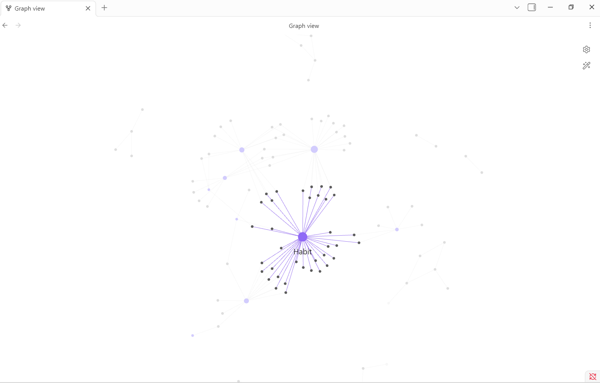
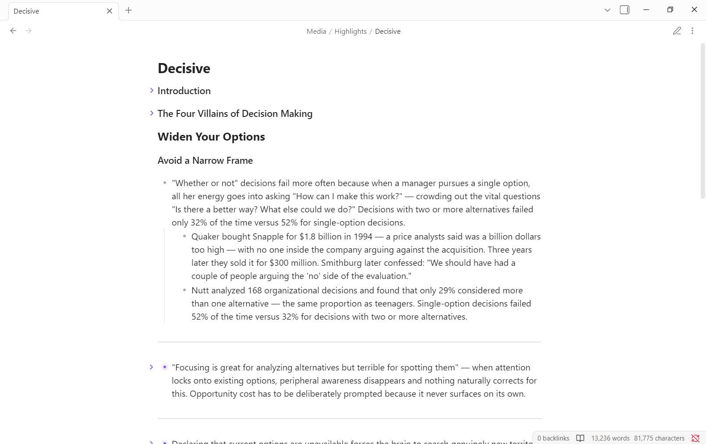
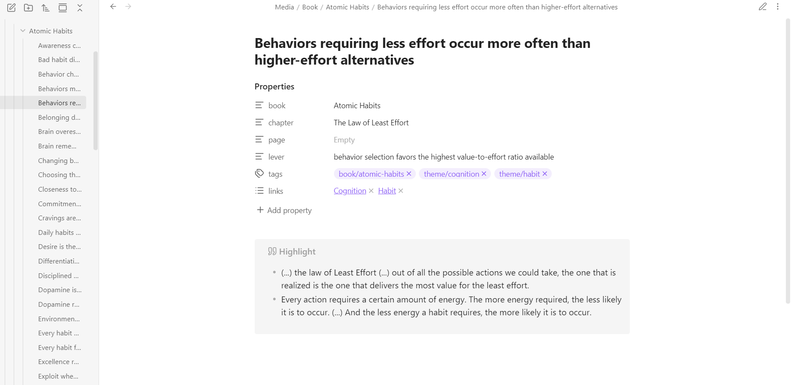

# Atomic Curator

> Turn **book chapters (PDF/EPUB)** and raw highlights into clean, self-contained **atomic notes** — with AI, following Zettelkasten principles. For [Obsidian](https://obsidian.md).

> 🚧 **Early and in active development.** This is a young, evolving project — shared openly so people can **use it, fork it, and shape it to their own workflow**. Expect rough edges. Bug reports, ideas, and pull requests are genuinely welcome, and you're free to use it however you like under the [MIT license](LICENSE).



---

Most AI note plugins **chat** with your notes. Atomic Curator does the opposite job: it **curates**. Point it at a book chapter (PDF or EPUB) or a pile of messy highlights, and it gives you back a set of true atomic notes — one idea each, self-contained, with a declarative title — ready to drop into your Zettelkasten.

It does the whole job end to end: **book file → atomic notes in your vault.**

## Why

Highlighting is easy. Turning highlights into notes you'll actually reuse is the hard, slow part of personal knowledge management. Atomic Curator does the mechanical part of that work so you can focus on thinking:

- **One idea per note.** A passage with three ideas becomes three notes.
- **Declarative titles.** Titles are full sentences that state the claim (`Spaced repetition beats massed practice for retention.`) — not vague topics (`Spaced repetition`).
- **Rewritten, not copied.** Bodies are restated in clear prose, not pasted verbatim.
- **You stay in control.** Every note is shown in a preview before anything is written. Uncheck what you don't want.

## Features

- ✅ **Curate from a book** — read a chapter straight from a PDF or EPUB in your vault.
- ✅ **Curate the active note** — turn any note of raw highlights into atomic notes.
- ✅ Preview-and-pick modal — nothing is created without your approval.
- ✅ **Rich note format** — mechanism-based title, a `lever` phrase, `book`/`chapter`/`page` frontmatter, a verbatim Highlight callout, and an Example callout.
- ✅ **Your own themes** — define your themes once in settings; each note is linked to 1–2 of them by mechanism (with matching `theme/…` tags and `[[Theme]]` links).
- ✅ Bring your own Anthropic API key — no middle-man server, no subscription.
- ✅ Choose your model: Haiku (fast/cheap), Sonnet (balanced), or Opus (best).
- ✅ Writes notes in the source's own language; custom instructions field for your conventions.

## How it works

**From a book (PDF/EPUB):**

1. Run **Curate from book (PDF/EPUB)** from the command palette.
2. Pick a book file in your vault and click **Load**. For EPUB, choose a chapter; for PDF, choose a page range.
3. Click **Extract & curate** — the chapter is read, distilled into atomic notes, and shown for review.
4. Uncheck any you don't want, then **Create**.

**From a note of highlights:**

1. Open a note containing raw highlights or messy text.
2. Run **Curate active note into atomic notes** (command palette, or the atom icon in the ribbon).
3. Review the proposed atomic notes and uncheck any you don't want.
4. Click **Create** — each selected note is written as its own file in your output folder.

> **PDF support is new in 0.2** — works with text-based PDFs (not scanned images). If you hit a PDF that doesn't extract, please [open an issue](../../issues).

## From highlights to atomic notes

You start with raw highlights (or a whole book chapter):



…and get back clean, **atomic** notes — one idea each, with a mechanism-based title, a `lever`, source metadata, and links to your themes:



On disk it's plain, portable markdown — the filename is the title (no redundant H1):

```markdown
---
book: "Atomic Habits"
chapter: "The Law of Least Effort"
page: ""
lever: "behavior selection favors the highest value-to-effort ratio available"
tags:
  - book/atomic-habits
  - theme/habit
  - theme/cognition
links:
  - "[[Habit]]"
  - "[[Cognition]]"
---

> [!quote] Highlight
> Out of all the possible actions we could take, the one that is realized is the
> one that delivers the most value for the least effort.

> [!example] Example
> The more energy a habit requires, the less likely it is to occur…
```

The `theme/…` tags and `[[Theme]]` links come from **your** theme list (configured in settings), chosen by mechanism — so the notes slot straight into your existing MOCs.

## Installation

### From the Community Plugins store
*Pending review — coming soon.*

### Via BRAT (test it now)
1. Install the [BRAT](https://github.com/TfTHacker/obsidian42-brat) plugin.
2. In BRAT, **Add Beta Plugin** → `jftr001/obsidian-atomic-curator`.
3. Enable **Atomic Curator** in Community Plugins.

### Manual
1. Download `main.js`, `manifest.json`, and `styles.css` from the [latest release](../../releases).
2. Copy them into `<your vault>/.obsidian/plugins/atomic-curator/`.
3. Reload Obsidian and enable the plugin.

## Setup

Open **Settings → Atomic Curator** and:

1. Paste your Anthropic API key (get one at [console.anthropic.com](https://console.anthropic.com)).
2. Pick a model and an output folder.
3. **List your themes** — one per line, optionally with a short description (e.g. `Habit — cue, routine, automaticity`). Each note is linked to 1–2 of these by mechanism. Leave it empty and the model will pick free-form themes instead.

## Privacy

Your API key is stored locally in your vault and is **only** sent to Anthropic to perform curation. The plugin has no server and collects nothing. Note that the content of the note you curate is sent to Anthropic's API as the input to be processed.

## Roadmap

Atomic Curator started as a personal curation system. Planned next:

- **MOC reconciliation** — place new atomic notes into the right Map of Content automatically.
- **Note audit** — scan a folder of notes for atomicity, title quality, and duplicates.
- **Pedagogical summaries** — generate a teaching summary from a cluster of notes.

## Contributing

This project is meant to be improved by the people who use it. If something is broken, missing, or could work better for your workflow, open an issue or send a PR — small fixes and big ideas are equally welcome. Fork it and make it yours.

To build locally:

```bash
npm install
npm run dev      # watch mode
npm run build    # production build
```

## License

[MIT](LICENSE)
